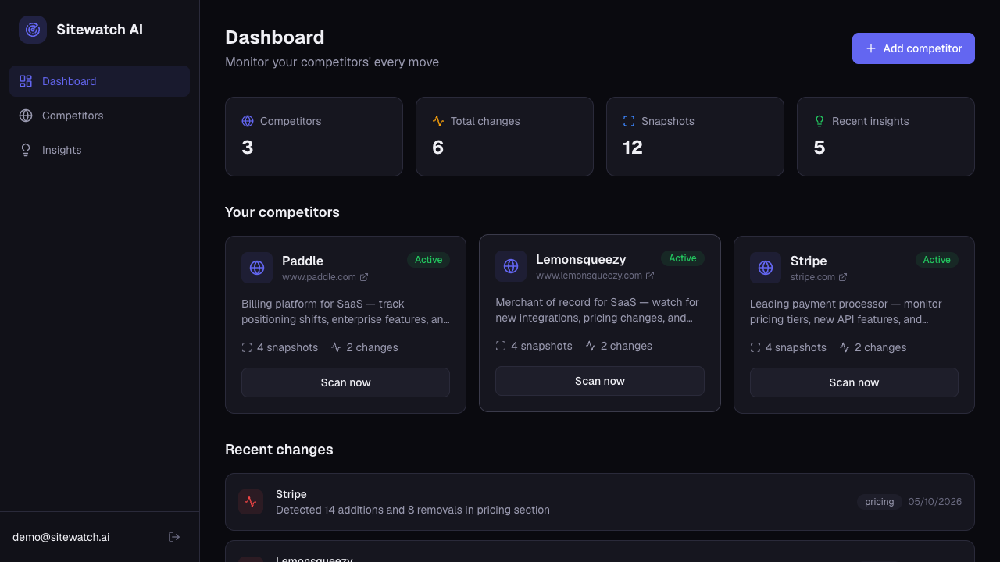

# Sitewatch AI

Autonomous competitive intelligence agent that monitors competitor websites, detects changes, and delivers strategic insights powered by Claude AI.

**Live demo:** [sitewatch-ai.vercel.app](https://sitewatch-ai.vercel.app) — click **Try the live demo** to enter a seeded account (3 competitors, 6 detected changes, AI insights). The backend runs on a free instance that sleeps when idle, so the first sign-in can take up to a minute.



## What it does

Sitewatch AI acts as a tireless competitive analyst. Add your competitors' URLs, and the system will:

1. **Scrape** their websites on demand or on a daily schedule
2. **Detect** meaningful changes — pricing updates, new features, content shifts, new pages
3. **Analyze** each change using Claude AI to explain *what* changed and *why* it matters strategically
4. **Recommend** specific actions you should take in response

Each change is scored by significance (1-10) and categorized by type (pricing, feature, content, design, new page, removed).

## Architecture

```
Frontend (Next.js)  ──>  REST API (Django + DRF)  ──>  Celery Tasks
     |                          |                          |
  Vercel                   Render                    scrape + diff
                               |                          |
                     PostgreSQL / SQLite          Claude AI Analysis
                               |                          |
                            Redis                   Insights DB
```

**Backend:** Django 5.1, Django REST Framework, Celery + Redis, JWT auth (SimpleJWT)

**Frontend:** Next.js 16, Tailwind CSS v4, Framer Motion, Recharts, Lucide icons

**AI:** Anthropic Claude API — analyzes HTML diffs and generates strategic intelligence with actionable recommendations

**Infrastructure:** Vercel (frontend) + Render (backend). The public demo keeps its data in SQLite inside the instance and re-seeds it on every start, and runs Celery tasks eagerly (in-process), so no worker or scheduler is running there. With `DATABASE_URL` and a Redis broker it runs on PostgreSQL with Celery workers and Beat.

## Key features

- **JWT Authentication** — Email-based registration, access/refresh token flow with auto-refresh
- **Competitor Management** — CRUD with business context field for better AI analysis
- **HTML Diffing Engine** — Unified diff comparison with noise filtering (strips scripts, styles, trivial changes)
- **AI-Powered Analysis** — Claude evaluates each change for strategic significance and generates specific recommendations
- **Real-time Dashboard** — Stats grid, competitor cards, recent changes timeline with significance-based color coding
- **Dark-first UI** — Custom CSS variable color system, glow effects, skeleton loaders, animated transitions
- **Responsive Design** — Mobile hamburger menu, adaptive grid layouts
- **Celery Beat Scheduler** — Configurable daily scraping for all active competitors

## Tech stack

| Layer | Technology |
|-------|-----------|
| Frontend | Next.js 16, TypeScript, Tailwind CSS v4, Framer Motion |
| Backend | Django 5.1, Django REST Framework, Celery |
| Database | PostgreSQL, or SQLite (local dev and the public demo) |
| Queue | Redis / Valkey |
| AI | Anthropic Claude API |
| Auth | JWT (djangorestframework-simplejwt) |
| Deploy | Vercel (frontend), Render (backend) |

## Running locally

### Backend

```bash
cd backend
python -m venv venv && source venv/bin/activate
pip install -r requirements.txt
python manage.py migrate
python manage.py seed_demo --email your@email.com  # optional: populate demo data
python manage.py runserver
```

### Frontend

```bash
cd frontend
npm install
cp .env.example .env.local
npm run dev
```

## Project structure

```
sitewatch-ai/
├── backend/
│   ├── config/          # Django settings, URLs, Celery config
│   ├── apps/
│   │   ├── accounts/    # Custom User model, JWT auth endpoints
│   │   ├── competitors/ # Competitor CRUD + scrape trigger
│   │   ├── scraping/    # HTML capture, diff engine
│   │   └── intelligence/# Change detection, Claude AI analysis, insights
│   └── requirements.txt
├── frontend/
│   └── src/
│       ├── app/         # Next.js App Router pages
│       ├── components/  # UI components (cards, modals, sidebar, toasts)
│       └── lib/         # API client, auth context
└── README.md
```

## License

MIT
